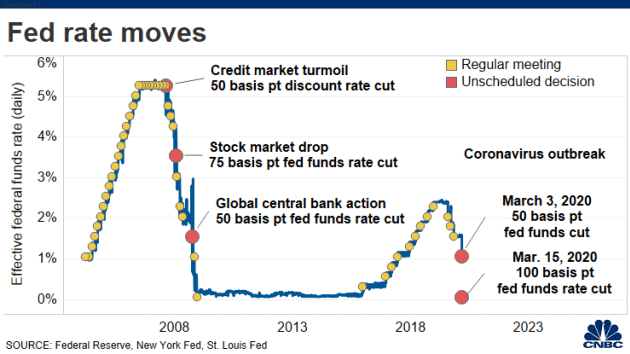
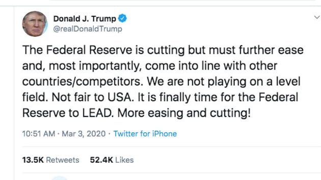
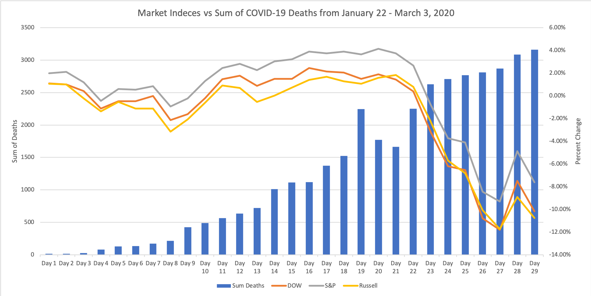

Stock Market Project 
The recent global health crisis has sent the media and the world into a frenzy. People are scrambling to get their groceries and personal supplies and governments seem to be in peril. The economy has slowed and employment is at its worst in years. To top it all off, people are rushing into to hospitals as new cases of the disease skyrockets. With an increase in academia supporting the link between public health and economic success, we wonder how will the amount of deaths associated with COVID-19 affect the stock market. Our results show a clear correlation between deaths and declines in the stock market. Business and economies across the globe are linked to the success of the stock market and the recent decline has made employers and employees suffer. We analyze the trend between the rise in deaths and the fall in the market to project how institutions should project economics responses to the crisis.
## US Stock Market Indicies Compared With Global COVID19 Deaths
It was found that there was a direct inverse relationship with the performace of the US stock market comapared to that of the total gloabl death count due to COVID19. As the amount of COVID19 cases increases, the US stock makerket as a whole falls. What can be noted is that after day 22 of the active COVID19 virus which marks a total of 2250 cases golablly marked a threshold point for US markets casusing them to fall consistently with increased cases. 

The market fell for 10 consistent days in this analysis as market fears began to rise with growing COVID19 cases. What begins to happen during day 27 is that there begins to be talks about the FED decresing interest rates to stimulate economic growth which can ecourage borrowing and investing. This is where there begins to be a rally for two days as investors think they have a buffer. The market will continue to fall as cases rise becuase stores and business will have to shut down due to the set National Emrgency which can impact indivual slaries utimately not putting money back into the economy (Figure 1). 

To battle this, president Trump tries to be reassuring with his tweets and messages saying that there will be stimulus money coming which can help all parts of the business model. Some of his tweets look like Figure 1. Trump does this to build confidence in investors and try to influence the market. 

What has been seen in China, the first country with virus, is that as their cases plateaued the volititly in the market fell as well. Looking at history, there becomes a consolidation period where the market for a few weeks to up to a month decides if it is vlaued at a specific price and utimately moves in that direction. This will only happen as the rate of deaths in the US begins to slow.  The following shows how the US Indexes compare to that of the total Gloabl COVID19 deaths. 

